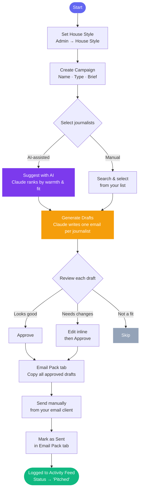
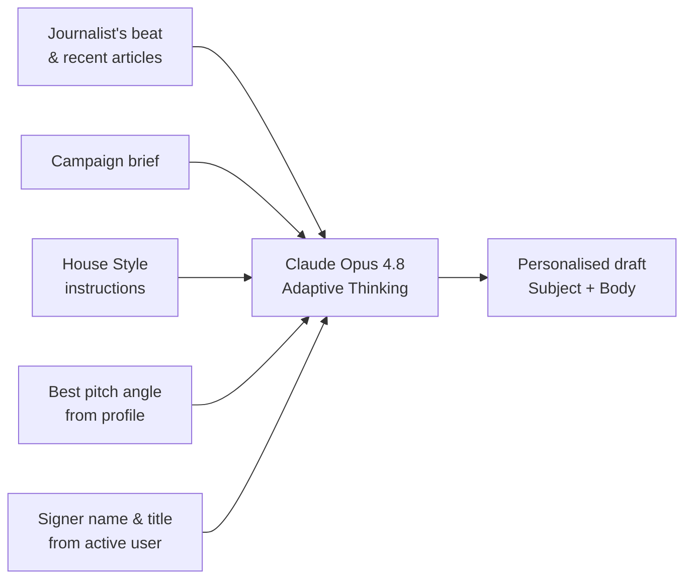

# Campaigns

Campaigns let you pitch a group of journalists at once, with Claude generating a personalised draft for each one based on their beat, recent articles, and your standing house style.

---

## Campaign workflow

---

## Step-by-step guide

### Step 1 — Set House Style (one-time per campaign type)

Go to **Admin → House Style** before generating your first drafts. Write standing instructions for each campaign type. Claude injects these into every prompt.

**Example instructions for a Cold Intro:**
- Keep subject lines under 8 words
- Lead with a specific hook about the journalist's recent work
- Mention the announcement in the second paragraph, not the first
- Sign off from the team member managing that outreach
- Avoid buzzwords ("disruptive", "groundbreaking", "revolutionary")

> House Style is shared across all campaigns of the same type. If you need one-off instructions for a specific campaign, put them in the **Brief** field instead.

---

### Step 2 — Create the campaign

Go to **Campaigns → New Campaign** and fill in:

| Field | What to write |
|---|---|
| **Name** | Something specific enough to be unambiguous in a list (e.g. `Press Launch — North Star AI Labs · July 2026`) |
| **Type** | Cold Intro / Event / Hackathon / Founder Promo |
| **Brief** | 2–4 sentences about what you're announcing and what angle you want journalists to take. This is the main context Claude uses — write it as if briefing a PR copywriter. |

**Example brief for a launch campaign:**
> *"North Star AI Labs is launching publicly in July 2026. We build AI tools for enterprise talent teams. We're targeting AI/startup journalists who cover enterprise software or the future of work. Focus on our differentiated approach to talent intelligence — not a generic AI announcement."*

---

### Step 3 — Select journalists

In the campaign detail, open the **Journalists tab**. You have two paths:

#### Option A — Suggest with AI (recommended)

Click **Suggest with AI** (purple button, top-right of the Journalists tab). Claude reads the campaign brief and every journalist in your roster, then returns a ranked list with reasons.

What Claude weighs (in priority order):

| Signal | Weight | Why |
|---|---|---|
| **Has written about North Star** | Highest | Existing coverage = proven interest; warmest possible contact |
| **Outreach relationship** | High | Responded / In Conversation / Covered = warm; use this over cold contacts |
| **Beat match to campaign angle** | High | "AI Startups & Venture Funding" >> "Technology" for a launch pitch |
| **Has email on file** | Medium | Can't reach who you can't contact |
| **Days since last published** | Medium | >90 days stale = flag; >180 days = likely beat change |
| **Total score** | Tiebreaker | Score is a general proxy — real context overrides it |

Results are split into two sections:

- **Recommended** (purple highlight) — 5–7 journalists Claude actively suggests adding, with reason chips per journalist and a warning if there's a concern (no email, geographic mismatch, stale, etc.)
- **Other journalists** — the rest of your roster, still ranked, available to add manually

Click **+ Add** on any row to add them directly. You can re-run suggestions at any time as your roster grows.

#### Option B — Manual search

If you prefer to browse, use the search box to filter by name, publication, or beat and add journalists directly.

---

**How to think about journalist selection:**

Don't just pick by score. Ask:
1. Has this journalist already written about us? → Top priority.
2. Have we had any prior contact? → Warm beats cold every time.
3. Does their specific beat match what we're announcing? → A "Startup funding" journalist is a better fit for a funding story than a generic tech reporter with a higher score.
4. Are they actively publishing? → Stale journalists may have moved beats or publications.
5. Do we have their contact info? → No email = lower realistic priority.

---

### Step 4 — Generate drafts

Click **Generate Drafts**. Claude runs in the background — one API call per journalist. Each draft is personalised using:

The page polls every 3 seconds while generation is running and switches to the **Drafts tab** automatically when ready.

---

### Step 4b — Add Campaign Assets (optional)

Campaign Assets are URLs and boilerplate text injected into every draft prompt so Claude can reference them naturally in the email body. To edit them, click the **pencil (Edit) icon** next to the campaign title to open the Edit Campaign panel — the Assets section is at the bottom of the panel.

| Field | What to put here |
|---|---|
| **Press Kit URL** | Link to your press kit folder or Notion page |
| **Photo Folder URL** | Link to product photos / founder headshots |
| **Demo URL** | Product demo link or video |
| **Boilerplate** | Standard one-paragraph company description — Claude uses this if the email needs one |

Click **Save changes** to save. The Campaign Assets collapsible on the main campaign page shows the current values as read-only — click the "Edit Campaign panel" link there to jump straight to editing.

---

### Step 5 — Review and edit drafts

Each draft shows a subject line and email body. For each journalist you can:

| Action | What it does |
|---|---|
| **Save edits** | Saves changes to subject/body without changing approval status |
| **Approve — add to Email Pack** | Marks as approved; draft appears in the Email Pack tab |
| **Regenerate** | Provide optional instructions and ask Claude to rewrite the draft |
| **Remove** | Removes this journalist from the send list for this campaign |

---

### Step 6 — Send from the Email Pack

Open the **Email Pack tab**. All approved drafts appear formatted for sending. The system never sends email autonomously — all outreach is reviewed and sent by a human.

You have two paths:

#### Option A — Save to Gmail Drafts (recommended)

If Gmail is connected (green "Save to Gmail Drafts" button), clicking it creates one pre-addressed Gmail draft per approved journalist. You open Gmail → Drafts, add any attachments, and hit Send yourself.

To connect Gmail the first time: click **Connect Gmail** in the Email Pack header. A Google consent screen opens — grant Gmail Compose access. Once connected, the button stays active for the account's lifetime.

#### Option B — Copy and paste

Use **Copy all** to get every email as a single block, or copy individual emails from each card. Paste into Gmail manually.

---

After sending each email, click **Mark as sent** at the bottom of its card. This:

- Logs the pitch to the **Activity Feed** (channel, subject, body, date)
- Sets the journalist's outreach status to **Pitched**
- Removes the card from the Email Pack (status changes to **Sent**, shown in green in Review Drafts)

> You don't need to manually log anything on the journalist's profile — Mark as sent handles it.

---

### Step 7 — Track resulting coverage

Open the **Coverage tab** on the campaign. Any press article that results from this campaign can be linked here so you can see, per campaign, how much coverage it generated.

- **Link articles** — search your press coverage log and click **+ Link** to associate an article with this campaign
- **Unlink** — click × to remove the association (the article is not deleted, just unlinked)
- The tab shows a count badge so coverage is visible at a glance

> Articles must first be added to the **Press Coverage** section before they can be linked to a campaign.

---

## Draft status reference

| Status | Colour | Meaning |
|---|---|---|
| **Pending** | Grey | Draft not yet generated |
| **Ready** | Blue | Draft generated, not yet reviewed |
| **Approved** | Light green | Approved and in the Email Pack |
| **Sent** | Dark green | Marked as sent; logged to Activity Feed |
| **Removed** | Muted grey | Excluded from this campaign's send list |
| **Failed** | Red | Claude generation failed; write manually |

---

## Editing a campaign

Click the **pencil icon** (Edit2) next to the campaign title to open the Edit Campaign slide-out panel. You can update:

| Field | Notes |
|---|---|
| **Name** | Can be changed at any time |
| **Type** | Changing the type counts as a brief change and will flag drafts as outdated |
| **Status** | Draft → Active → Completed → Archived |
| **Campaign brief** | Changing the brief flags existing pending/ready drafts as outdated |
| **Campaign Assets** | Press kit URL, photo folder URL, demo URL, boilerplate |

### Outdated drafts banner

If you change the brief or campaign type and save, an amber banner appears on the campaign page: **"Brief or type has changed — some drafts may be outdated."** A **Regenerate pending & ready drafts** button appears to bulk-rewrite all drafts that haven't yet been approved or sent. Approved and sent drafts are not touched.

---

## Campaign status

| Status | Meaning |
|---|---|
| **Draft** | Being set up — drafts may not be generated yet |
| **Active** | Outreach in progress |
| **Completed** | Campaign finished — all pitches sent |
| **Archived** | Parked for reference; excluded from active campaign counts |

Change status via the Edit Campaign panel (pencil icon next to the campaign title).

---

## Campaign types

| Type | Use case | Typical brief focus |
|---|---|---|
| **Cold Intro** | First-time outreach | Who we are, why this journalist specifically |
| **Event** | Inviting to a North Star event | Event details, why it's relevant to their beat |
| **Hackathon** | Hackathon announcement / coverage request | Prize pool, themes, participant profile |
| **Founder Promo** | Founder profile / thought leadership | Founder background, unique POV, available for comment |

---

## House Style vs. Brief — when to use which

| | House Style | Campaign Brief |
|---|---|---|
| **Scope** | All campaigns of this type, forever | This specific campaign only |
| **Contains** | Tone, structure, what to avoid, sign-off | Story angle, announcement details, target audience context |
| **Changed by** | Admin (deliberate update) | Created per campaign |

---

## AI features in campaigns

### Journalist suggestion

- Model: Claude Opus 4.8 with adaptive thinking
- Reads every journalist's full profile: score breakdown, outreach status, beat, last published date, email presence, follower count, admin notes, and whether they've written about North Star
- Cross-references the Press Coverage table — any journalist who has covered North Star is flagged with a "Covered us" badge and ranked highest
- Re-runnable at any time; results update immediately after you add journalists (added rows show "Added" inline)
- Results are not saved — re-run to refresh after adding new journalists to your roster

### Draft generation

- Model: Claude Opus 4.8 with adaptive thinking
- One API call per journalist, processed sequentially in the background
- Draft sign-off uses the **currently selected user** (bottom of sidebar) — select your name before generating
- Writing constraints: 3–4 short paragraphs, under 200 words, subject line under 8 words
- Only references article titles that are confirmed in the system — Claude will not hallucinate or paraphrase article titles
- If a draft fails, its status shows as **Failed**; you can write the email manually in the draft editor
- Drafts are saved to the database — closing the page and returning is safe
- Generation order is not guaranteed; the page polls every 3 seconds and shows status per journalist as each completes
